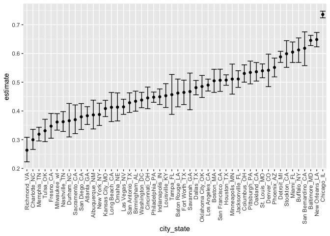
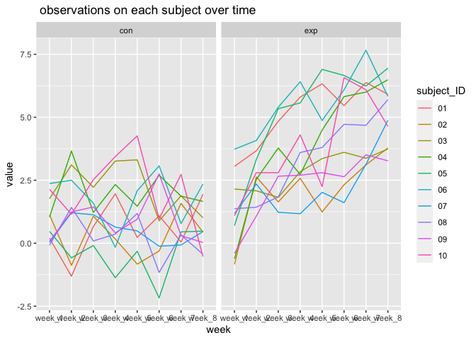

p8105\_hw5\_sl5010
================
Fiona Li
11/18/2021

``` r
library(tidyverse)
```

    ## ── Attaching packages ─────────────────────────────────────── tidyverse 1.3.1 ──

    ## ✓ ggplot2 3.3.5     ✓ purrr   0.3.4
    ## ✓ tibble  3.1.4     ✓ dplyr   1.0.7
    ## ✓ tidyr   1.1.3     ✓ stringr 1.4.0
    ## ✓ readr   2.0.1     ✓ forcats 0.5.1

    ## ── Conflicts ────────────────────────────────────────── tidyverse_conflicts() ──
    ## x dplyr::filter() masks stats::filter()
    ## x dplyr::lag()    masks stats::lag()

## Problem 1

``` r
homicides_df = read_csv("Data/homicide-data.csv")
```

    ## Rows: 52179 Columns: 12

    ## ── Column specification ────────────────────────────────────────────────────────
    ## Delimiter: ","
    ## chr (9): uid, victim_last, victim_first, victim_race, victim_age, victim_sex...
    ## dbl (3): reported_date, lat, lon

    ## 
    ## ℹ Use `spec()` to retrieve the full column specification for this data.
    ## ℹ Specify the column types or set `show_col_types = FALSE` to quiet this message.

``` r
# Describe the raw data
homicides_df = 
  homicides_df %>%
 mutate(
    city_state = str_c(city, state, sep = "_"),
    resolved = case_when(
      disposition == "Closed without arrest" ~ "unsolved",
      disposition == "Open/No arrest"        ~ "unsolved",
      disposition == "Closed by arrest"      ~ "solved",
    )
  ) %>% 
  select(city_state, resolved) %>% 
  filter(city_state != "Tulsa_AL")
```

``` r
aggregate_df = 
  homicides_df %>% 
  group_by(city_state) %>% 
  summarize(
    hom_total = n(),
    hom_unsolved = sum(resolved == "unsolved")
  )
aggregate_df
```

    ## # A tibble: 50 × 3
    ##    city_state     hom_total hom_unsolved
    ##    <chr>              <int>        <int>
    ##  1 Albuquerque_NM       378          146
    ##  2 Atlanta_GA           973          373
    ##  3 Baltimore_MD        2827         1825
    ##  4 Baton Rouge_LA       424          196
    ##  5 Birmingham_AL        800          347
    ##  6 Boston_MA            614          310
    ##  7 Buffalo_NY           521          319
    ##  8 Charlotte_NC         687          206
    ##  9 Chicago_IL          5535         4073
    ## 10 Cincinnati_OH        694          309
    ## # … with 40 more rows

``` r
prop.test(
  aggregate_df %>% filter(city_state == "Baltimore_MD") %>% pull(hom_unsolved), 
  aggregate_df %>% filter(city_state == "Baltimore_MD") %>% pull(hom_total)) %>% 
  broom::tidy()
```

    ## # A tibble: 1 × 8
    ##   estimate statistic  p.value parameter conf.low conf.high method    alternative
    ##      <dbl>     <dbl>    <dbl>     <int>    <dbl>     <dbl> <chr>     <chr>      
    ## 1    0.646      239. 6.46e-54         1    0.628     0.663 1-sample… two.sided

``` r
results_df = 
  aggregate_df %>% 
  mutate(
    prop_tests = map2(.x = hom_unsolved, .y = hom_total, ~prop.test(x = .x, n = .y)),
    tidy_tests = map(.x = prop_tests, ~broom::tidy(.x))
  ) %>% 
  select(-prop_tests) %>% 
  unnest(tidy_tests) %>% 
  select(city_state, estimate, conf.low, conf.high)
```

``` r
results_df %>% 
  mutate(city_state = fct_reorder(city_state, estimate)) %>% 
  ggplot(aes(x = city_state, y = estimate)) +
  geom_point() + 
  geom_errorbar(aes(ymin = conf.low, ymax = conf.high)) + 
  theme(axis.text.x = element_text(angle = 90, vjust = 0.5, hjust = 1))
```

<!-- -->

## Problem 2

``` r
path_df = 
  tibble(
    path = list.files("Data/lda_data/"),
  ) %>% 
  mutate(
    path = str_c("Data/lda_data/", path),
    data = map(.x=path, read_csv)) %>%
unnest()
```

    ## Warning: `cols` is now required when using unnest().
    ## Please use `cols = c(data)`

``` r
head(path_df)
```

    ## # A tibble: 6 × 9
    ##   path                   week_1 week_2 week_3 week_4 week_5 week_6 week_7 week_8
    ##   <chr>                   <dbl>  <dbl>  <dbl>  <dbl>  <dbl>  <dbl>  <dbl>  <dbl>
    ## 1 Data/lda_data/con_01.…   0.2   -1.31   0.66   1.96   0.23   1.09   0.05   1.94
    ## 2 Data/lda_data/con_02.…   1.13  -0.88   1.07   0.17  -0.83  -0.31   1.58   0.44
    ## 3 Data/lda_data/con_03.…   1.77   3.11   2.22   3.26   3.31   0.89   1.88   1.01
    ## 4 Data/lda_data/con_04.…   1.04   3.66   1.22   2.33   1.47   2.7    1.87   1.66
    ## 5 Data/lda_data/con_05.…   0.47  -0.58  -0.09  -1.37  -0.32  -2.17   0.45   0.48
    ## 6 Data/lda_data/con_06.…   2.37   2.5    1.59  -0.16   2.08   3.07   0.78   2.35

``` r
### Tidy the data
path_df = 
path_df %>%
janitor::clean_names() %>%
separate(path, into = c("Data", "lda_data", "path"), sep ="/") %>%
separate(path, into = c("control_arm", "subject_ID"), sep ="_") %>%
  mutate(subject_ID = str_replace(subject_ID, ".csv", "")) %>%
  select(-Data, -lda_data) %>%
    pivot_longer(
    week_1:week_8,
    names_to = "week", 
    values_to = "value")
path_df
```

    ## # A tibble: 160 × 4
    ##    control_arm subject_ID week   value
    ##    <chr>       <chr>      <chr>  <dbl>
    ##  1 con         01         week_1  0.2 
    ##  2 con         01         week_2 -1.31
    ##  3 con         01         week_3  0.66
    ##  4 con         01         week_4  1.96
    ##  5 con         01         week_5  0.23
    ##  6 con         01         week_6  1.09
    ##  7 con         01         week_7  0.05
    ##  8 con         01         week_8  1.94
    ##  9 con         02         week_1  1.13
    ## 10 con         02         week_2 -0.88
    ## # … with 150 more rows

``` r
## Make a spaghetti plot showing observations on each subject over time, and comment on differences between groups.
path_df %>%
    ggplot(aes(x = week, y = value, color = subject_ID, group = subject_ID)) +
  labs(title = " observations on each subject over time") + geom_line() +
  facet_grid(. ~ control_arm)
```

<!-- -->

**comment on differences between groups.** For the control group, the
trend is not positive, and for experiment group, we see a positive
trend, that is, the value increases while time increases.

## Problem 3

``` r
## loading the data set
library(tidyverse)

set.seed(10)

iris_with_missing = iris %>% 
  map_df(~replace(.x, sample(1:150, 20), NA)) %>%
  mutate(Species = as.character(Species))
iris_with_missing
```

    ## # A tibble: 150 × 5
    ##    Sepal.Length Sepal.Width Petal.Length Petal.Width Species
    ##           <dbl>       <dbl>        <dbl>       <dbl> <chr>  
    ##  1          5.1         3.5          1.4         0.2 setosa 
    ##  2          4.9         3            1.4         0.2 setosa 
    ##  3          4.7         3.2          1.3         0.2 setosa 
    ##  4          4.6         3.1          1.5        NA   setosa 
    ##  5          5           3.6          1.4         0.2 setosa 
    ##  6          5.4         3.9          1.7         0.4 setosa 
    ##  7         NA           3.4          1.4         0.3 setosa 
    ##  8          5           3.4          1.5         0.2 setosa 
    ##  9          4.4         2.9          1.4         0.2 setosa 
    ## 10          4.9         3.1         NA           0.1 setosa 
    ## # … with 140 more rows

``` r
## Write a function that takes a vector as an argument; replaces missing values using the rules defined above; and returns the resulting vector. 

missing_value = function(x) {
   if (is.numeric(x)) {
     replace_na(x, round(mean(x,na.rm = TRUE), digits = 1))
   }
  else if(is.character(x)){
    replace_na(x,"virginica")
  }
} 

map_dfr(iris_with_missing, missing_value)
```

    ## # A tibble: 150 × 5
    ##    Sepal.Length Sepal.Width Petal.Length Petal.Width Species
    ##           <dbl>       <dbl>        <dbl>       <dbl> <chr>  
    ##  1          5.1         3.5          1.4         0.2 setosa 
    ##  2          4.9         3            1.4         0.2 setosa 
    ##  3          4.7         3.2          1.3         0.2 setosa 
    ##  4          4.6         3.1          1.5         1.2 setosa 
    ##  5          5           3.6          1.4         0.2 setosa 
    ##  6          5.4         3.9          1.7         0.4 setosa 
    ##  7          5.8         3.4          1.4         0.3 setosa 
    ##  8          5           3.4          1.5         0.2 setosa 
    ##  9          4.4         2.9          1.4         0.2 setosa 
    ## 10          4.9         3.1          3.8         0.1 setosa 
    ## # … with 140 more rows
